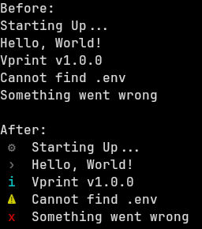

# fivelog - Beautiful and Simple Console Logger

Tired of plain logs? Use this.



# Install

```bash
npm install fivelog # or use yarn, pnpm, bun, etc (any package manager)
```

# Usage

```js
import logger from "fivelog";

logger.debug("Starting Up...");
logger.log("Hello, World!");
logger.info("Vlogger v1.0.0");
logger.warn("Cannot find .env");
logger.error("Something went wrong");
```
